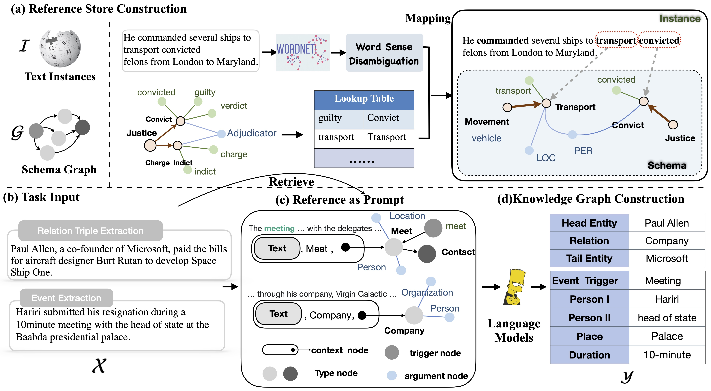

# RAP

Code for our paper "[Schema-aware Reference as Prompt Improves Data-Efficient
Relational Triple and Event Extraction](https://arxiv.org/pdf/2210.10709.pdf)".

<div align=center></div>

## Requirements

```
Java 8 # for elasticsearch
elasticsearch==7.17.1
```
* This requirement is for retrieving tools.

## Retrieving for Reference

For different base models, you can generate the reference by following codes:

```bash
cd retrieval/ 
python retrieve.py --base_model prgc
```

The parameter `--base_model` is for different base models, we can change it in `prgc`, `relationprompt`, `t2e`, `degree`.

For `Text2Event` and `DEGREE`, please follow the instruction README.md document in their corresponding folder to preprocess the datasets, and then generate the retrieved reference.


## BaseModel

We plugged RAP to several base models, which can be seen in the folders below: 

```text
BaseModel
├── DEGREE
├── PRGC
├── RelationPrompt
└── Text2Event
```

The code of above base models are borrowed from their original codes with slight modifacations.

**DEGREE** : Please follow the instruction [here](./BaseModel/DEGREE/README.md).

**PRGC** : Please follow the instruction [here](./BaseModel/PRGC/README.md).

**RelationPrompt** : Please follow the instruction [here](./BaseModel/RelationPrompt/README.md).

**Text2Event** : Please follow the instruction [here](./BaseModel/Text2Event/README.md).

# Citation
If you use the code, please cite the following paper:

```bibtex
@article{DBLP:journals/corr/abs-2210-10709,
  author    = {Yunzhi Yao and
               Shengyu Mao and
               Xiang Chen and
               Ningyu Zhang and
               Shumin Deng and
               Huajun Chen},
  title     = {Schema-aware Reference as Prompt Improves Data-Efficient Relational
               Triple and Event Extraction},
  journal   = {CoRR},
  volume    = {abs/2210.10709},
  year      = {2022},
  url       = {https://doi.org/10.48550/arXiv.2210.10709},
  doi       = {10.48550/arXiv.2210.10709},
  eprinttype = {arXiv},
  eprint    = {2210.10709},
  timestamp = {Tue, 25 Oct 2022 14:25:08 +0200},
  biburl    = {https://dblp.org/rec/journals/corr/abs-2210-10709.bib},
  bibsource = {dblp computer science bibliography, https://dblp.org}
}
```
